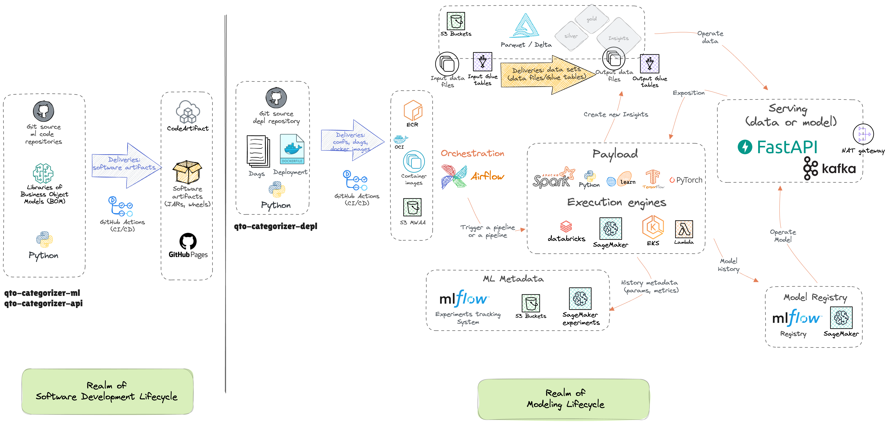

# Qto Categorizer Deployment

This repository contains all the necessary configurations and deployment files for deploying the Qto Categorizer service across different environments (development, pre-production, production).

## Overview

This project features the deployment part of ML modeling jobs, typically on clusters (e.g., Spark on DataBricks job clusters or Sagemaker or Kubeflow) and API operations typically on Kubernetes (e.g., GKE for GCP or equivalent on AWS).

As the workload takes the shape of (Docker) container images, this repository provides the necessary infrastructure to:
- Build and manage container images for both ML training/inference and API services
- Deploy ML jobs on various cloud platforms (DataBricks, SageMaker, Kubeflow)
- Deploy API services on Kubernetes clusters
- Manage configurations across different environments
- Orchestrate deployments using Airflow

## Deployment Workflow



### Artifact Management

1. The software artifact (Python wheel) is generated and stored in the artifact repository manager
2. This repository handles the deployment process:
   - Builds a container (Docker) image that installs the software artifact using pip
   - Publishes the container image to a container registry (e.g., AWS Elastic Container Registry (ECR))
   - Manages versioning and tagging of container images

### Execution Engine Deployment

The containerized workload is then deployed to the appropriate execution engine:
- ML jobs: DataBricks, SageMaker, or Kubeflow clusters
- API services: Kubernetes clusters (GKE, EKS, etc.)


## Table of Contents (ToC)
- [Qto Categorizer Deployment](#qto-categorizer-deployment)
  - [Overview](#overview)
  - [Deployment Workflow](#deployment-workflow)
    - [Artifact Management](#artifact-management)
    - [Execution Engine Deployment](#execution-engine-deployment)
  - [Table of Contents (ToC)](#table-of-contents-toc)
  - [Repository Structure](#repository-structure)
  - [Components](#components)
    - [1. Configuration Files (confs/)](#1-configuration-files-confs)
    - [2. Docker Images (docker/)](#2-docker-images-docker)
    - [3. Kubernetes Deployment (k8s/)](#3-kubernetes-deployment-k8s)
    - [4. Airflow Integration (airflow/)](#4-airflow-integration-airflow)

## Repository Structure

```
.
├── confs/               # Configuration files for different environments
│   ├── api/            # API service configurations
│   └── ml/             # ML service configurations
├── docker/             # Dockerfile and related files
│   ├── api/            # API service Dockerfile
│   └── ml/             # ML service Dockerfile
├── k8s/                # Kubernetes deployment manifests
└── airflow/            # Airflow DAGs and configurations
```

## Components

### 1. Configuration Files (confs/)

The `confs` directory contains environment-specific configuration files that can be stored in S3 (for example). These configurations are used by both the API and ML services.

### 2. Docker Images (docker/)

- **API Service**: Contains the Dockerfile for building the `qto-categorized-api` Python module container
- **ML Service**: Contains the Dockerfile for building the `qto-categorized-ml` Python module container (training, tuning, inference)

### 3. Kubernetes Deployment (k8s/)

Contains Kubernetes manifests for deploying the services, including:
- Deployments
- Services
- ConfigMaps
- Secrets
- Ingress configurations

### 4. Airflow Integration (airflow/)

Contains Airflow DAGs and configurations for orchestrating the deployment process.
